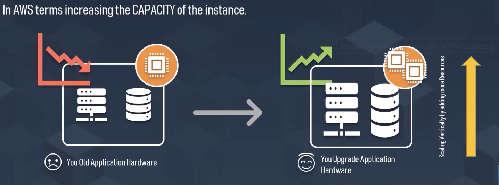
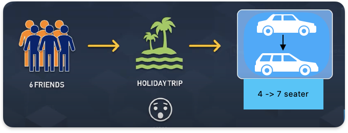
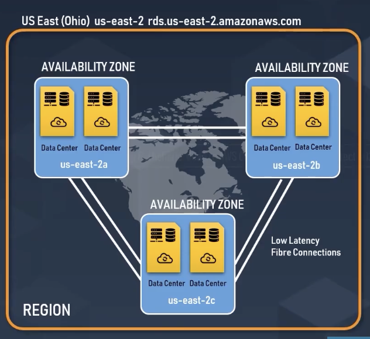
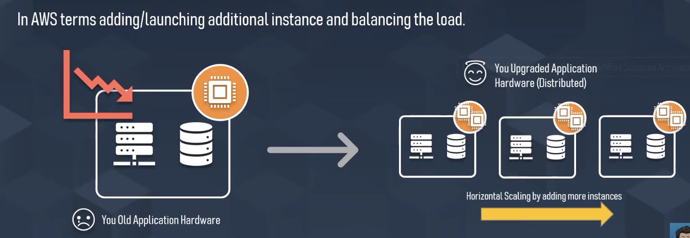
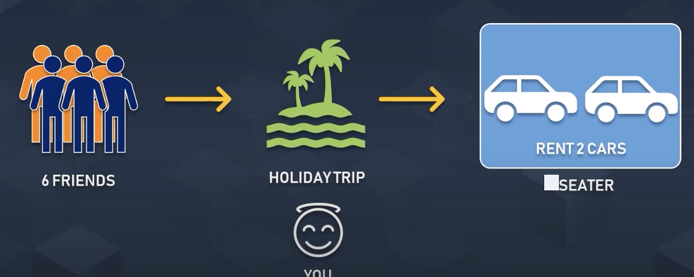

# System Design

## Overview

- Learn about System Design components

## Topics

- [x] **CDN**
  - geographically democratize the data storage so that the data is closer to the user during read. So, for application with write/read ratio as 1:10, it is better to use CDN.

---

- [x] **Database selection**

  - There are cases where relational DB is better than NoSQL DB. E.g. if the data is highly structured and the data is not changing frequently, then relational DB is better. Like in Instagram, in order to create shorts, the data is highly structured and the data is not changing frequently. So, relational (**SQL**) DB is better to store the user data. But, then there is a need to store the video metadata. So, in this case, **NoSQL** DB is better. Because it can be used to store the video metadata inclusive of video properties - thumbnail, title, description, etc. Also, NoSQL DB is good for recommendation algorithm as it can be fed into a recommendation algorithm faster due to low latency.

    > Note that the file (video) storage is done into Amazon S3 cloud storage here.

  - **DB** storage is **NOT** recommended for image, video storage in form of encoded format. As the user grows, DB cost is going to be very high. So, it is better to store the image, video in form of encoded format in cloud storage like **Amazon S3**.

---

- [x] **Vertical scaling** (**up/down** `⬆️`/`⬇️`) is the process of increasing or reducing the size or power of a single instance in order to help it better respond to changing workloads. Vertical scaling enables you to increase or reduce the amount of memory, CPU cores, network bandwidth and other resources available to each individual instance. It is often used to improve performance or to increase the number of instances to handle more requests or users.

  - Use cases:
    - Used in non-distributed systems like databases, ROS, etc.
  - So, in a computer system, the processor, ram and storage are the components that can be scaled vertically.
  - In AWS, increase the **size** of the instance.

    

  - In the similar eg as previous, a bigger car has to be hired in order to accommodate more people. So, **the capacity of the car** is increased.

    

---

- [x] **Horizontal Scaling** (**in/out** `>---<` `<--->`) is the process of increasing or decreasing the capacity of a cloud environment by adding or removing instances. Horizontal scaling allows you to quickly increase or decrease the amount of computing power you have available and is often used to adjust your environment to accommodate more requests or users.

  - Use cases:
    - Used in distributed systems/microservices based. Hosting your app in multiple AZs (Availability Zones) across the globe.
      
    - in load balancer (multi AZ)
    - in auto scaling group (multi AZ)
  - Features:
    - High availability is on the line of the horizontal scaling.
    - make it more available to the users by having them hosted across multiple AZs (Availability Zones) across the globe.
    - It will help your users reduce failures of one or two data centres going down.
  - Cons: very expensive as more identical resources would be required.
  - So, in a computer system, more computers can be added to the system in order to increase the capacity of the system. This is called horizontal scaling.
  - In AWS, increase the **number** of instances in the Auto Scaling Group.
    

  Imagine, there is a holiday planned for 3 friends & then 3 more friends join them. So, in order to accommodate more people, more cars of same size has to be hired. So, **the number of cars** is increased.
  

---

- [x] **Horizontal vs Vertical Scaling comparo**

| Horizontal Scaling                                                         | Vertical Scaling                                   |
| -------------------------------------------------------------------------- | -------------------------------------------------- |
| Load balancing required                                                    | N/A                                                |
| **Resilient**                                                              | Single point of failure                            |
| Network calls (RPC)                                                        | Shared memory i.e. **inter-process communication** |
| Data inconsistency i.e. delay in having the same data across all instances | Data **consistency**                               |
| **Scales as users increases i.e. via adding more instances**               | Hardware limit                                     |

> Now, the question is, when to use which scaling technique?
>
> Both are important. But, it depends on the use case. If the use case is such that the data is not changing frequently, then vertical scaling is better. But, if the data is changing frequently, then horizontal scaling is better. Moreover, keep a note of the bolded points in the table above.

- [x] Cloud storage selection
  - Amazon S3 is used for storing the video files or large files. The reasons for this are:
    - reliability (99.999999999%) as there are multiple copies of the data stored in different AZs (Availability Zones) across the globe.
    - high throughput during read/write
    - low latency due to CDN
- [ ] Rate limiting
  - Ideally it means if there is a limit of some activity to be done in a given time period. E.g. in **TikTok**, suppose there is a limit of 3 short videos that can be uploaded in 10 hrs. So, if a user tries to upload more than 3 short videos in 10 hrs, then the user will be blocked for the next 10 hrs.
- [ ] Caching
  - recommended to use Redis
- [ ] Message Broker
  - recommended to use Redis
- [ ] Low Level Design
- [ ] High Level Design
- [ ] Load balancing
- [ ] Microservices
- [ ] Monolithic vs Microservices
- [ ] Containerization

## References

- [System Design YT playlist | Gaurav Sen](https://www.youtube.com/watch?v=xpDnVSmNFX0&list=PLMCXHnjXnTnvo6alSjVkgxV-VH6EPyvoX)
- [Low level design | Gaurav Sen](https://www.youtube.com/watch?v=gktZsX9Z8Kw&list=PLMCXHnjXnTnvQVh7WsgZ8SurU1O2v_UM7)
- [Low level design | sudoCODE](https://www.youtube.com/watch?v=B3zrIwz_t4M&list=PLTCrU9sGybupCpY20eked6blbHI4zZ55k)
- [Vertical Scalability vs Horizontal Scalability | Visual Explanations](https://www.youtube.com/watch?v=YE1ytf15WOQ) ✅
- [System Design Basics: Horizontal vs. Vertical Scaling | Gaurav Sen](https://youtu.be/xpDnVSmNFX0) ✅
